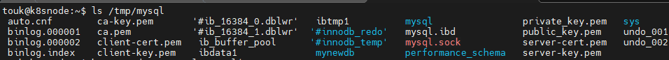

# MySQL Deployment and Service Configuration

This repository contains Kubernetes configuration files for deploying a MySQL database using a Deployment and exposing it with a NodePort Service. Below is a brief overview of the key components and their purposes:

## Deployment (mysql-deploy.yaml)

The Deployment resource manages the MySQL database instance. It specifies the following:

-   **Name**: `mysql-deploy`
-   **Selector**: Matches pods with the label `app: mysql`
-   **Containers**:
    -   Container name: `mysql`
        -   Docker image: `mysql:latest`
        -   Environment variable `MYSQL_ROOT_PASSWORD` obtained from a Secret
        -   Resource limits: 500Mi of memory and 500m of CPU
        -   Exposes port 3306 for MySQL
        -   Mounts a persistent storage volume at `/var/lib/mysql`

## Secret (mysql-secret.yaml)

A Secret resource for storing sensitive data, in this case, the MySQL root password, encoded as base64.

## Service (mysql-service.yaml)

The Service resource exposes the MySQL deployment to external access via a NodePort. Key details:

-   **Name**: `mysql-service`
-   **Service Type**: NodePort
-   Exposes MySQL port 3306
-   NodePort set to 31000
-   Selects pods with the label `app: mysql`

## Persistent Volume (mysql-pv.yaml) and Persistent Volume Claim (mysql-pv-claim.yaml)

The Persistent Volume and Persistent Volume Claim resources are used to manage persistent storage for the MySQL database. The details include:

-   **PV Name**: `mysql-pv`
-   Storage capacity: 1Gi
-   Access mode: ReadWriteOnce
-   Storage class: manual
-   Reclaim policy: Delete
-   HostPath used for storage

## NetworkPolicy (deny-traffic-to-mysql.yaml)

This NetworkPolicy resource restricts incoming traffic to the MySQL pods, allowing only pods with the label `purpose: mysqlclient` to access port 3306 (MySQL). Pods without this label are denied access.

Feel free to use these Kubernetes configuration files to set up a MySQL database deployment and service in your Kubernetes cluster. Make sure to customize any values, such as passwords and storage paths, to fit your specific environment and requirements
```
touk@k8smaster:~$ k get pods -n mysql-netpolicy -w
NAME                            READY   STATUS    RESTARTS   AGE
mysql-deploy-75db46bdf6-lc4cw   1/1     Running   0          8s

touk@k8smaster:~$ kubectl exec -it mysql-deploy-75db46bdf6-lc4cw -n mysql-netpolicy -- mysql -uroot -p
Enter password:
Welcome to the MySQL monitor.  Commands end with ; or \g.
Your MySQL connection id is 8
Server version: 8.1.0 MySQL Community Server - GPL

Copyright (c) 2000, 2023, Oracle and/or its affiliates.

Oracle is a registered trademark of Oracle Corporation and/or its
affiliates. Other names may be trademarks of their respective
owners.

Type 'help;' or '\h' for help. Type '\c' to clear the current input statement.
mysql> show databases;
+--------------------+
| Database           |
+--------------------+
| information_schema |
| mysql              |
| performance_schema |
| sys                |
+--------------------+
4 rows in set (0.00 sec)

mysql> create database mynewdb;
Query OK, 1 row affected (0.00 sec)

mysql> show databases;
+--------------------+
| Database           |
+--------------------+
| information_schema |
| mynewdb            |
| mysql              |
| performance_schema |
| sys                |
+--------------------+
5 rows in set (0.00 sec)

```